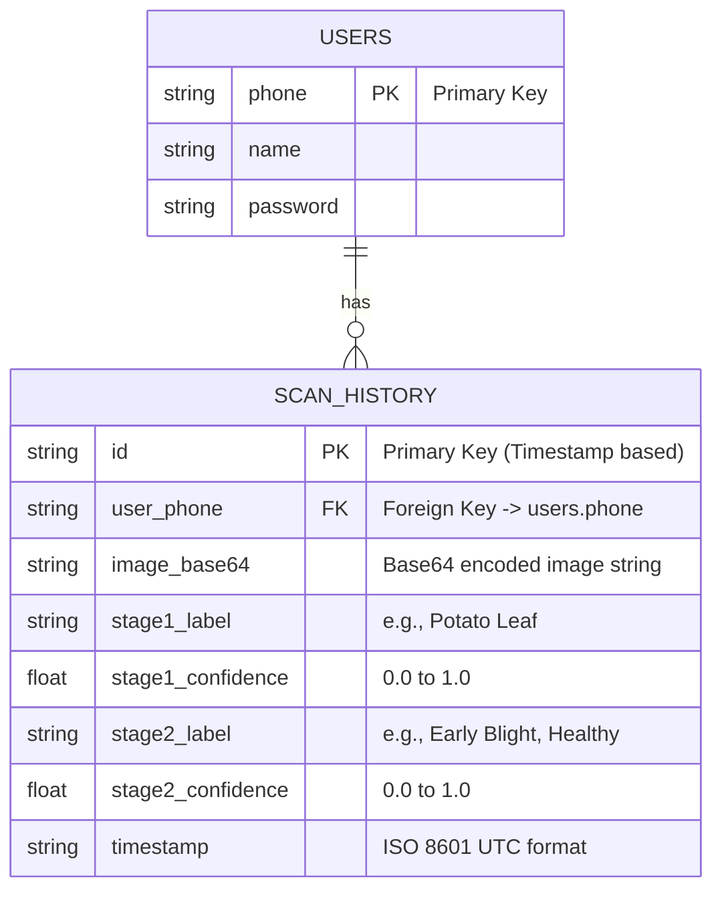

# Database Schema (ERD)

This Entity-Relationship Diagram shows the structure of the MobiKD database.

```mermaid
erDiagram
    USERS ||--o{ SCAN_HISTORY : "has"

    USERS {
        string phone PK "Primary Key"
        string name
        string password
    }

    SCAN_HISTORY {
        string id PK "Primary Key (Timestamp based)"
        string user_phone FK "Foreign Key -> users.phone"
        string image_base64 "Base64 encoded image string"
        string stage1_label "e.g., Potato Leaf"
        float stage1_confidence "0.0 to 1.0"
        string stage2_label "e.g., Early Blight, Healthy"
        float stage2_confidence "0.0 to 1.0"
        string timestamp "ISO 8601 UTC format"
    }
```
