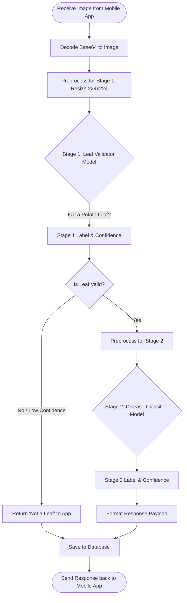

# AI Inference Pipeline

This flowchart details the 2-stage inference process executed by the backend when an image is received.

```mermaid
graph TD
    Start([Receive Image from Mobile App]) --> Decode[Decode Base64 to Image]
    Decode --> Preprocess1[Preprocess for Stage 1: Resize 224x224]
    
    %% Stage 1
    Preprocess1 --> Model1{Stage 1: Leaf Validator Model}
    Model1 -->|Is it a Potato Leaf?| Result1[Stage 1 Label & Confidence]
    
    Result1 --> CheckLeaf{Is Leaf Valid?}
    
    %% Stage 1 Failure
    CheckLeaf -->|No / Low Confidence| Reject[Return 'Not a Leaf' to App]
    Reject --> SaveDB[Save to Database]
    
    %% Stage 2
    CheckLeaf -->|Yes| Preprocess2[Preprocess for Stage 2]
    Preprocess2 --> Model2{Stage 2: Disease Classifier Model}
    Model2 --> Result2[Stage 2 Label & Confidence]
    
    %% Stage 2 Results
    Result2 --> Formatter[Format Response Payload]
    Formatter --> SaveDB
    
    %% End
    SaveDB --> End([Send Response back to Mobile App])
```
